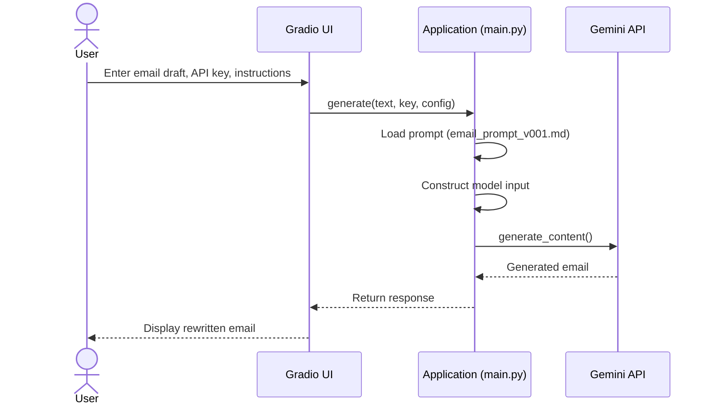

# Email Modifier

A lightweight internal tool for rewriting draft emails according to predefined email etiquette rules. The application provides a simple web interface built with Gradio and uses the Google Gemini API for text generation.

This project is intended for developer and internal productivity use. It allows users to convert informal or incomplete email drafts into properly structured messages following company email guidelines.

## Overview

The application performs the following steps:

1. Loads email instruction rules from a Markdown prompt file.
2. Accepts a draft email from the user through a web interface.
3. Combines the prompt instructions with the draft email.
4. Sends the combined text to the Gemini API.
5. Returns a rewritten email based on the defined guidelines.

The rewriting behavior is controlled entirely by the prompt file, allowing modification of email rules without changing application code.


## Request Flow




## Repository Structure

```
project-root
│
├── main.py
├── main_for_exe.py (Optional.)
├── README.md
├── requirements.txt
│
└── prompts
  └── email_prompt_v001.md
```

### File Descriptions

- **main.py**: Main application containing the Gradio interface and Gemini API integration.
- **prompts/email_prompt_v001.md**: Markdown file containing the email formatting and etiquette rules used by the model.
- **requirements.txt**: Python dependency list required to run the application.

## Requirements

### Python Version

Python 3.9 or higher

### Python Packages

- gradio
- google-genai

### API Key

Gemini API Key from [Google AI Studio]("https://aistudio.google.com/").

## Installation

Install dependencies (recommended in venv):
```
pip install -r requirements.txt
```


## Configuration

The application loads email rewriting instructions from the following file:

`prompts/email_prompt_v001.md`

This file defines the email etiquette rules used by the model. Modifying this file will change how emails are rewritten.

### Example Conceptual Structure of the Prompt

```
Email writing rules

Email texts you should modify:
[user email draft]
```

## Running the Application

Start the application:

```
python main.py
```

The Gradio server will start locally.

Typical local address: http://127.0.0.1:7860

Because the application launches with `share=True`, Gradio will also generate a temporary public URL.

## Interface Components

The web interface contains the following fields:

- **Email Instruction**: Displays the loaded email rewriting rules from the prompt file.
- **Input Draft Email**: User-provided email draft to be rewritten.
- **Insert Gemini API Key**: Gemini API key used for authentication.
- **Modify Email**: Button that sends the request to the model.
- **Output Email**: AI-generated rewritten email.

## Model Configuration

The current implementation uses the following model:

`gemini-3-flash-preview`

The model name can be modified directly in `main.py` if a different Gemini model is required.

## Customization

Email behavior is controlled through the prompt file:

`prompts/email_prompt_v001.md`

Typical modifications include:

- Adjusting email tone (formal, neutral)
- Defining greeting and closing structure
- Enforcing paragraph formatting
- Correcting grammar and clarity

Because the system is prompt-driven, most behavioral changes do not require modifying application code.

## Security Notes

- The Gemini API key is entered manually through the UI and is not stored by the application.
- The public share link generated by Gradio is temporary.
- For internal deployment environments, disabling `share=True` is recommended.


## Additional: Build `.exe` files
You can make executable files with typing these two lines:

1. Install one more dependency (recommended in venv as well): 
```
pip install pyinstaller
```
2. Use `pyinstaller` with FILE_NAME and IMAGE_NAME (extension should be `.ico`): 
```
pyinstaller --onefile -n "FILE_NAME" --icon=IMAGE_NAME.ico --collect-all gradio --collect-all safehttpx --collect-all groovy --collect-all google-genai main_for_exe.py
```
Extension between `.exe` and `.app` depends on your Local(Windows/Mac).

Visit [Pyinstaller Manual]("https://pyinstaller.org/en/stable/index.html") official documents for information in detail.